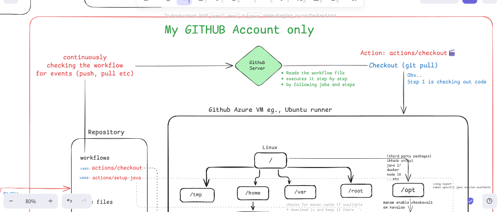

# 🖥️ Runner Internals - Overview

Understanding WHERE things live in the Runner VM!

---

## 📚 This Folder Covers

| File | Topic | Time |
|------|-------|------|
| [01-filesystem.md](./01-filesystem.md) | The complete directory structure | 5 min |
| [02-hostedtoolcache.md](./02-hostedtoolcache.md) | Where Java, Node.js live | 4 min |
| [03-how-actions-work.md](./03-how-actions-work.md) | YAML → Script → Execution | 5 min |

---

## 🗺️ The Big Picture

```
GitHub Actions Runner VM (Ubuntu)
│
├── /home/runner/
│   ├── .m2/repository/        ← Maven dependencies (cached!)
│   └── work/                  ← Your code lands here
│       └── {repo}/{repo}/     ← GITHUB_WORKSPACE
│
├── /opt/hostedtoolcache/      ← Pre-installed tools
│   ├── Java/17.x/
│   ├── node/20.x/
│   └── Python/3.11/
│
└── /home/runner/work/_actions/ ← Downloaded action code
    └── actions/setup-java/v4/
```

---

## 📸 Your Diagrams

Check the `diagrams/` folder for Excalidraw visualizations!



---

**Start with [01-filesystem.md](./01-filesystem.md)** 👉
