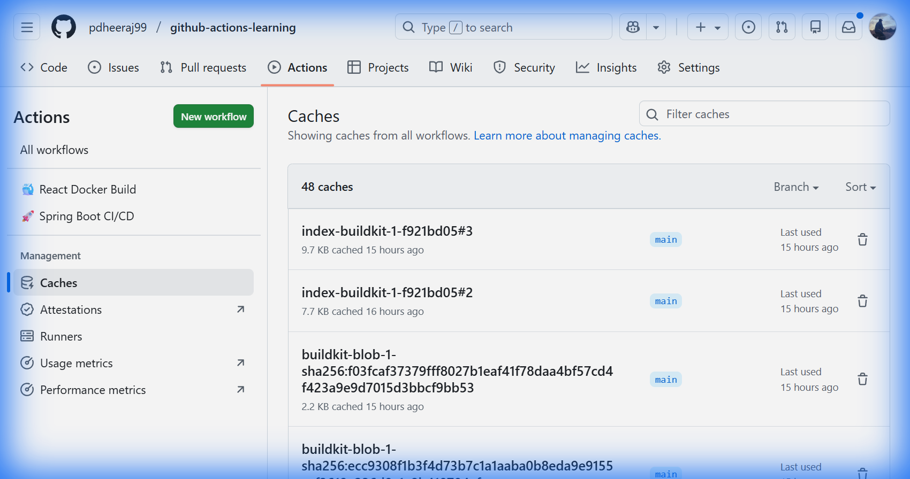
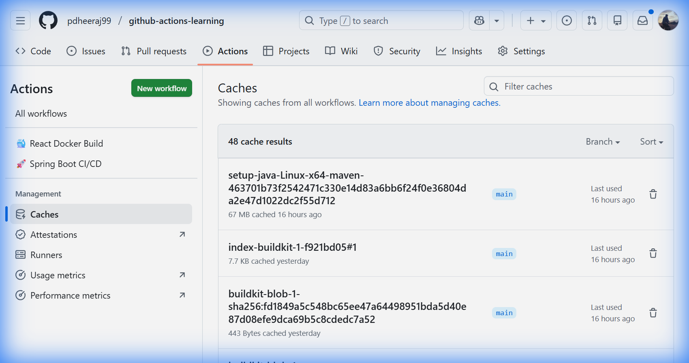
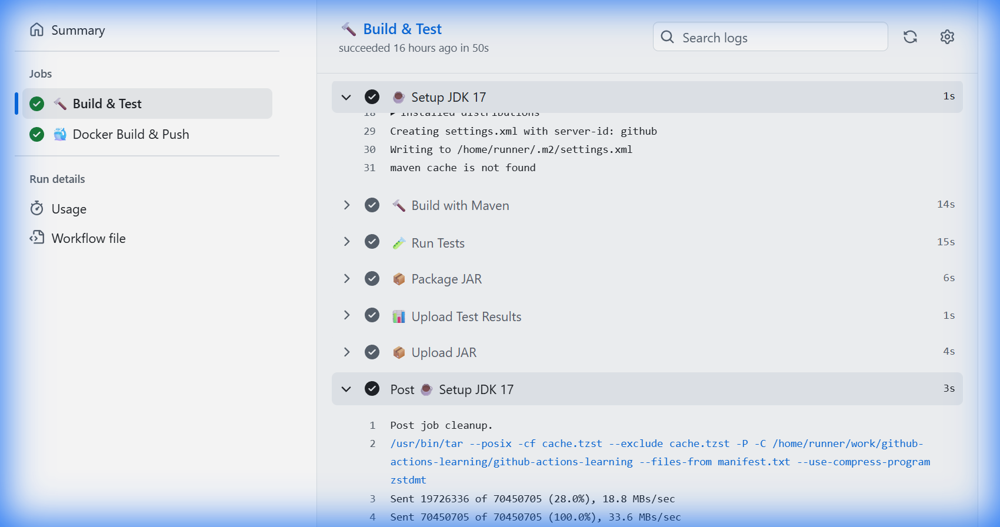
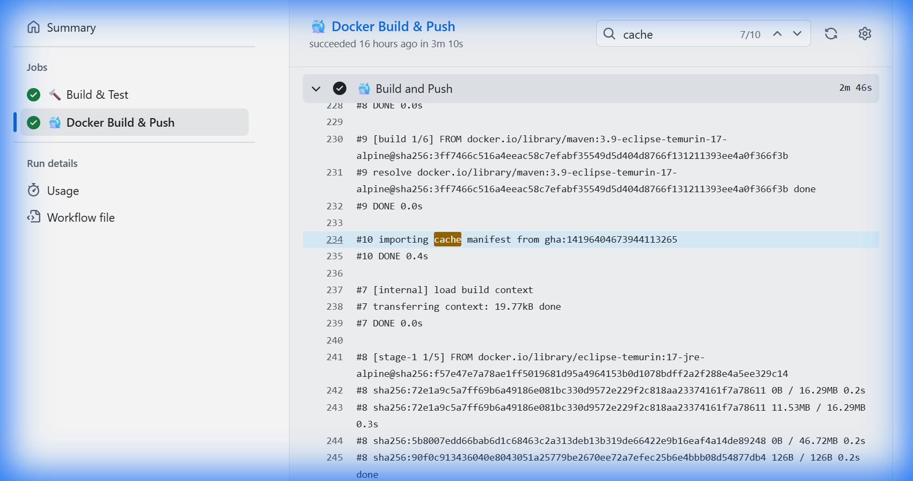
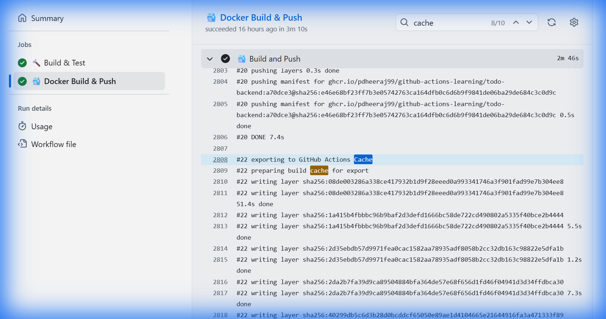
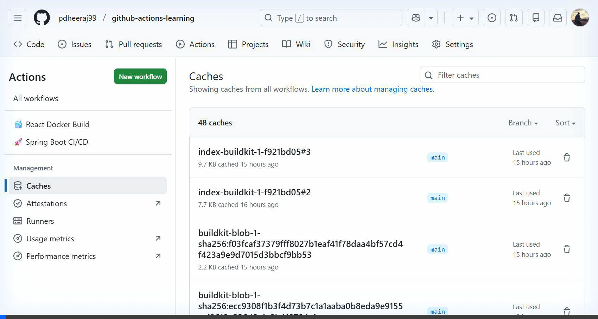

# 🔄 GitHub Actions Caching - Deep Dive with Visual Proof

This guide explains **exactly how caching works** in GitHub Actions with real screenshots and video recordings from your workflow runs.

---

## 📊 Table of Contents

1. [What is Caching?](#-what-is-caching)
2. [Cache Storage Location](#-cache-storage-location)
3. [Your Caches (Live Screenshots)](#-your-caches-live-screenshots)
4. [Cache READ (MISS/HIT)](#-cache-read-misshit)
5. [Cache WRITE (SAVE)](#-cache-write-save)
6. [Docker Layer Caching](#-docker-layer-caching)
7. [Video Recordings](#-video-recordings)
8. [Summary Flow](#-summary-flow)

---

## 🎯 What is Caching?

Caching speeds up your CI/CD pipelines by **saving downloaded dependencies** between workflow runs.

**Without Cache:**

```
Every Run: Download 200+ Maven JARs = 2-3 minutes ⏱️
```

**With Cache:**

```
First Run: Download + Save to cache = 2-3 minutes
Next Runs: Restore from cache = 10-20 seconds ⚡
```

**Telugu lo:** Cache ante previous run lo download chesina files ni GitHub cloud lo save chesi, next run lo reuse cheyadam. Time save avuthundi!

---

## 📍 Cache Storage Location

**IMPORTANT: Cache is NOT stored in the Runner VM!**

```
┌─────────────────────────────────────────────────────────────────────────────┐
│                                                                              │
│   ❌ WRONG THINKING:                                                         │
│   "Cache is in runner... but runner gets destroyed..."                      │
│                                                                              │
│   ✅ CORRECT:                                                                │
│   Cache is stored in GITHUB CLOUD STORAGE (separate from runner!)           │
│                                                                              │
│   ┌──────────────────┐                ┌─────────────────────────┐           │
│   │   Runner VM      │                │   GitHub Cloud Storage   │           │
│   │   (Temporary)    │   Upload cache │   (Permanent per repo)   │           │
│   │                  │ ═══════════════▶                          │           │
│   │  ~/.m2/repo/     │   at job end   │   Cache Key: maven-xxx   │           │
│   │                  │                │   Size: 67 MB            │           │
│   │  💀 DESTROYED!   │ ◀═══════════════  ✅ PERSISTS!            │           │
│   │                  │  Download cache│                          │           │
│   │                  │  at job start  │                          │           │
│   └──────────────────┘                └─────────────────────────┘           │
│                                                                              │
└─────────────────────────────────────────────────────────────────────────────┘
```

**Cache Scope:**

- ✅ Per Repository (not per account, not per runner)
- ✅ Maximum size: 10 GB per repository
- ✅ Expires after 7 days of no access

---

## 📸 Your Caches (Live Screenshots)

### Cache Management Page

Navigate to: **Settings → Actions → Caches** or use URL:
`https://github.com/pdheeraj99/github-actions-learning/actions/caches`



**What you see:**

- **48 caches** in your repository
- Branch filter (`main`)
- "Last used" timestamps

---

### Maven Cache (67 MB)



**Key Entry:**

```
setup-java-Linux-x64-maven-...
Size: 67 MB
Last used: 16 hours ago
Branch: main
```

This is your **Maven dependency cache** - all Spring Boot JARs!

---

## 📥 Cache READ (MISS/HIT)

### What is Cache MISS?

Cache MISS = The cache was **not found** and dependencies must be downloaded fresh.

**When it happens:**

- First run of workflow
- Cache key changed (pom.xml modified)
- Cache expired (7 days unused)

### Screenshot: Cache MISS


**Log message:** `maven cache is not found`

This appears in the **"☕ Setup JDK 17"** step when cache lookup fails.

---

### What is Cache HIT?

Cache HIT = The cache **was found** and restored! No need to download.

**Log message (next run will show):**

```
Cache restored from key: setup-java-Linux-x64-maven-xxxxx
```

---

## 📤 Cache WRITE (SAVE)

After a successful build, the cache is **saved for future runs**.

### Screenshot: Cache SAVE



**Log message:**

```
Sent 70450705 of 70450705 (100.0%), 33.6 MBs/sec
```

This appears in the **"Post ☕ Setup JDK 17"** step (at the end of the job).

**What got saved:**

- Size: 70.4 MB (Maven dependencies)
- Upload speed: 33.6 MB/s
- Location: GitHub Cloud Storage

---

## 🐳 Docker Layer Caching

Docker builds also use caching through Buildx!

### Configuration in workflow

```yaml
- name: 🐳 Build and Push
  uses: docker/build-push-action@v5
  with:
    cache-from: type=gha   # Read from GitHub Actions cache
    cache-to: type=gha,mode=max   # Write to GitHub Actions cache
```

### Screenshot: Docker Cache IMPORT



**Log message:** `importing cache manifest from gha:14196404673944113265`

This shows Docker is reading cached layers!

---

### Screenshot: Docker Cache EXPORT



**Log messages:**

```
#22 exporting to GitHub Actions Cache
#22 preparing build cache for export
```

This shows Docker is saving layers for next build!

---

## 🎬 Video Recordings

The following video recordings show the complete process:

### Recording 1: Cache Page Navigation



Shows: Navigating to cache management page, viewing cache entries, filtering for Maven.

---

### Recording 2: Cache Miss and Save Logs


Shows: Opening workflow run, finding Setup JDK step, viewing cache miss and save logs.

---

### Recording 3: Docker Cache Logs


Shows: Opening docker-build job, searching for cache messages, viewing import/export logs.

---

## 🔄 Summary Flow

```
┌─────────────────────────────────────────────────────────────────────────────┐
│                                                                              │
│   WORKFLOW RUN LIFECYCLE WITH CACHE                                         │
│   ════════════════════════════════════                                       │
│                                                                              │
│   ┌──────────────────────────────────────────────────────────────────────┐  │
│   │  JOB START                                                           │  │
│   │  ═══════════                                                          │  │
│   │                                                                       │  │
│   │  Step: Setup JDK 17                                                   │  │
│   │  ├── Check for cache key: setup-java-Linux-maven-{hash}              │  │
│   │  ├── If FOUND → "Cache restored from key: xxx" → FAST! ⚡            │  │
│   │  └── If NOT FOUND → "maven cache is not found" → Download deps 📥    │  │
│   └──────────────────────────────────────────────────────────────────────┘  │
│                                     │                                        │
│                                     ▼                                        │
│   ┌──────────────────────────────────────────────────────────────────────┐  │
│   │  BUILD STEPS                                                          │  │
│   │  ════════════                                                         │  │
│   │                                                                       │  │
│   │  mvn clean compile -B    ← Uses dependencies from ~/.m2/repository   │  │
│   │  mvn test -B             ← Uses dependencies from ~/.m2/repository   │  │
│   │  mvn package -B          ← Uses dependencies from ~/.m2/repository   │  │
│   └──────────────────────────────────────────────────────────────────────┘  │
│                                     │                                        │
│                                     ▼                                        │
│   ┌──────────────────────────────────────────────────────────────────────┐  │
│   │  JOB END (Post Steps)                                                 │  │
│   │  ═════════════════════                                                │  │
│   │                                                                       │  │
│   │  Step: Post Setup JDK 17                                              │  │
│   │  ├── If cache HIT → "Cache hit, not saving" → Skip save              │  │
│   │  └── If cache MISS → "Sent XXX bytes" → Upload to GitHub Cloud 📤    │  │
│   └──────────────────────────────────────────────────────────────────────┘  │
│                                     │                                        │
│                                     ▼                                        │
│   ┌──────────────────────────────────────────────────────────────────────┐  │
│   │  GITHUB CLOUD STORAGE                                                 │  │
│   │  ═════════════════════                                                │  │
│   │                                                                       │  │
│   │  Cache saved:                                                         │  │
│   │  ├── Key: setup-java-Linux-x64-maven-{pom.xml-hash}                  │  │
│   │  ├── Size: 67 MB                                                      │  │
│   │  ├── Expires: 7 days after last use                                  │  │
│   │  └── Ready for NEXT run! ✅                                          │  │
│   └──────────────────────────────────────────────────────────────────────┘  │
│                                                                              │
└─────────────────────────────────────────────────────────────────────────────┘
```

---

## 🎯 Key Takeaways

| Question | Answer |
|----------|--------|
| **Where is cache stored?** | GitHub Cloud Storage (not in runner!) |
| **Cache scope?** | Per repository |
| **Max size?** | 10 GB per repository |
| **Expiry?** | 7 days of no access |
| **How to view?** | Settings → Actions → Caches |
| **Maven cache size?** | ~67 MB (your repo) |
| **Docker cache size?** | Multiple entries (layers) |
| **How to see logs?** | Actions → Run → Job → Setup step |

---

## 📝 Telugu Summary (Ardham)

**Cache enti?**

- Previous run lo download chesina files ni GitHub cloud lo save cheyyadam
- Next run lo aa files ni reuse cheyyadam

**Cache ekkada undhi?**

- Runner VM lo kaadu! GitHub cloud storage lo undhi
- Runner destroy ayyina cache safe ga untundhi

**Cache ela work avuthundhi?**

1. **Job start** - Cache key check avthundi
2. **Cache found** - "Cache restored" → Fast build!
3. **Cache not found** - Download fresh → Slow build
4. **Job end** - New cache upload avthundi

**Savings:**

- First run: ~3 minutes (download everything)
- Next runs: ~30 seconds (use cache)
- **Savings: 2.5 minutes per build!** 🚀

---

**Created with real screenshots from your workflow runs!**
